

  

    <a href="#home">Jianhua Sun</a>
  

  

    <a href="#home">Home</a>
    <a href="#research">Research</a>
    <!-- <a href="#group">Group</a> -->
    <!-- <a href="#teaching">Teaching</a> -->
    <!-- <a href="#talks">Talks</a> -->
    <a href="#publications">Publications</a>
  

<section id="home">

# Jianhua Sun

**Office:** School of Artificial Intelligence, Room 209  
**Email:** gothic [at] sjtu (dot) edu (dot) cn  
[Google Scholar](https://scholar.google.com/citations?view_op=list_works&hl=zh-CN&hl=zh-CN&user=L0hoY3kAAAAJ) / [SJTU Profiles](https://soai.sjtu.edu.cn/)

#### Research Communities
  - [School of Artificial Intelligence, Shanghai Jiao Tong University (SAI, SJTU)](https://sai.sjtu.edu.cn/)
  - [Shanghai Innovation Institute (SII)](https://www.sii.edu.cn/)
  - [Shanghai Noematrix Intelligence Technology Ltd](https://www.noematrix.ai/)

</section>

#

I am an Assistant Professor in [the School of Artificial Intelligence](https://sai.sjtu.edu.cn/) at Shanghai Jiao Tong University. I finished my Ph.D. in the Department of Computer Science at Shanghai Jiao Tong University in 2025, under the supervision of [Prof. Cewu Lu](https://scholar.google.com.hk/citations?hl=en&user=QZVQEWAAAAAJ&view_op=list_works). Prior to that, I received my Bachelor's degree (Computer Science) from Shanghai Jiao Tong University in 2020. 

#

## Research

My research interests lie in Physical AI --- teaching AI to learn physical models of real-world concepts in order to build machines that possess a rich understanding of the world for perceiving, reasoning, interacting with the environment, and communicating with humans. My research spans from physical world representations to learning algorithms, including
  - **representations of physical world concepts** in an analytic form, enabling rigorous numerical computation and simulation
  - **structured priors** that encode phsyical laws and social rules, guiding AI in commonsense reasoning
  - **physical world perception, generation and planning algorithms** adhere to the fundamental rules of how the world operates
  - **lifelong learning** to optimize physical-world models and evolve learning algorithms

In addition to developing the representations and algorithms themselves, we simultaneously explore their applications in various domains:
  - **robotics and embodied AI**
  - **simulation and world model**
  - **multi-modal fundation model**
  - **autonomous driving**
  - **AI-assisted design and content generation**

**Recruitment:** Looking for self-motivated students (Master & Ph.D. spring & fall, undergraduate interns, visitors) to join us in [MVIG](https://www.mvig.org/). Feel free to email me directly with your CV (Subject: Recruitment + Institution + Field of Study + Academic Year + Name).

#

## Publications
(* and † indicate equal contribution and corresponding author)

<table>
<tr>
<td width="20%">

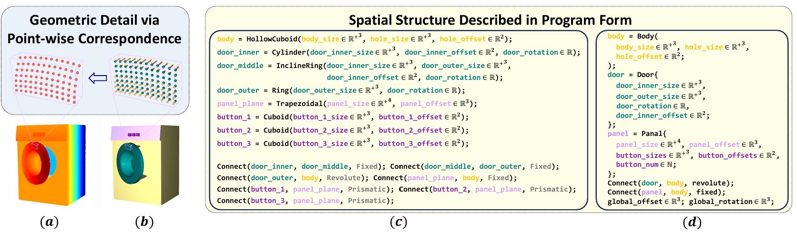

</td>
<td width="80%">

**[Arti-PG: A Toolbox for Procedurally Synthesizing Large-Scale and Diverse Articulated Objects with Rich Annotations](https://arxiv.org/pdf/2412.14974)**  
IEEE/CVF International Conference on Computer Vision (ICCV), 2025  
**Jianhua Sun***, Yuxuan Li*, Jiude Wei*, Longfei Xu, Nange Wang, Yining Zhang, Cewu Lu  

</td>
</tr>
</table>

<table>
<tr>
<td width="20%">

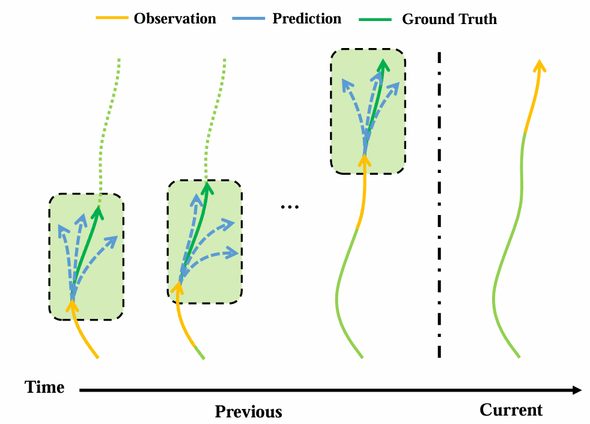

</td>
<td width="80%">

**[Interactive Adjustment for Human Trajectory Prediction with Individual Feedback](https://openreview.net/pdf?id=DCpukR83sw)**  
International Conference on Learning Representations (ICLR), 2025  
**Jianhua Sun***, Yuxuan Li*, Liang Chai, Cewu Lu  

</td>
</tr>
</table>

<table>
<tr>
<td width="20%">

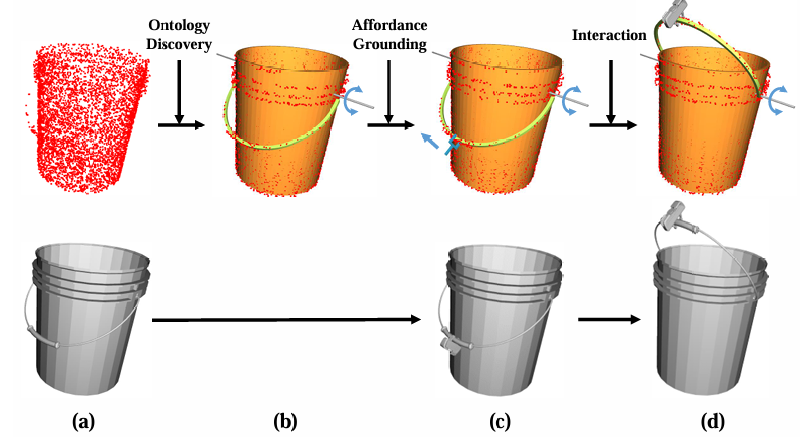

</td>
<td width="80%">

**[Discovering Conceptual Knowledge with Analytic Ontology Templates for Articulated Objects](https://ojs.aaai.org/index.php/AAAI/article/view/33609/35764)**  
AAAI Conference on Artificial Intelligence (AAAI), 2025  
**Jianhua Sun***, Yuxuan Li*, Longfei Xu, Jiude Wei, Liang Chai, Cewu Lu  

</td>
</tr>
</table>

<table>
<tr>
<td width="20%">

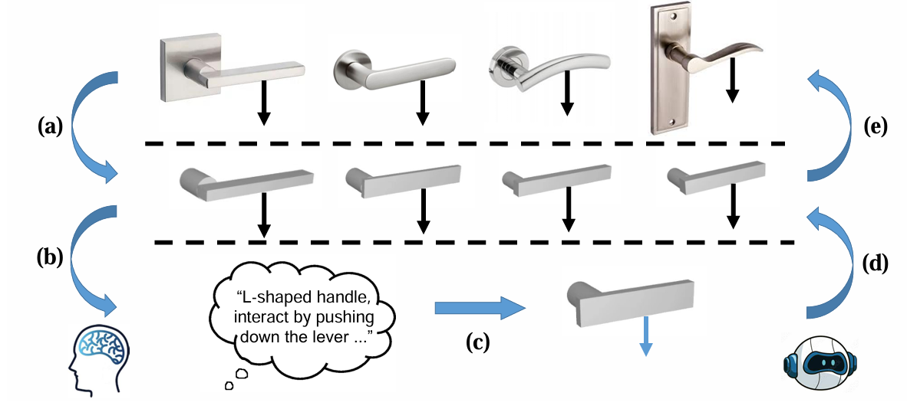

</td>
<td width="80%">

**[ConceptFactory: Facilitate 3D Object Knowledge Annotation with Object Conceptualization](https://proceedings.neurips.cc/paper_files/paper/2024/file/89d19544d314740d11c0974ca3ddaf70-Paper-Datasets_and_Benchmarks_Track.pdf)**  
Conference on Neural Information Processing Systems (NeurIPS), 2024  
**Jianhua Sun***, Yuxuan Li*, Longfei Xu, Nange Wang, Jiude Wei, Yining Zhang, Cewu Lu  

</td>
</tr>
</table>

<table>
<tr>
<td width="20%">

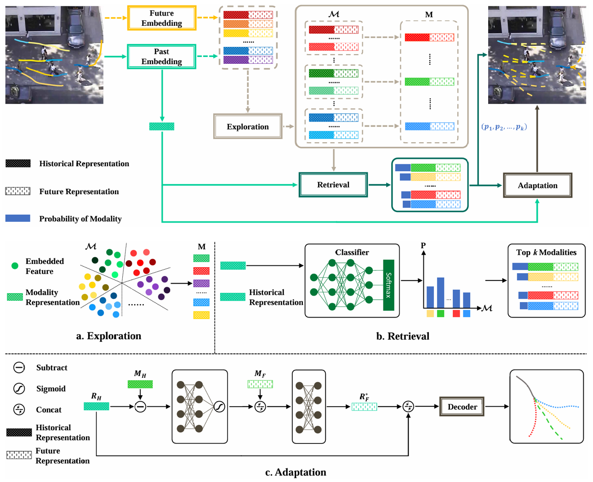

</td>
<td width="80%">

**[Modality Exploration, Retrieval and Adaptation for Trajectory Prediction](https://ieeexplore.ieee.org/document/10254381)**  
IEEE Transactions on Pattern Analysis and Machine Intelligence (TPAMI), 2024  
**Jianhua Sun**, Yuxuan Li, Liang Chai, Cewu Lu  

**[Three Steps to Multimodal Trajectory Prediction: Modality Clustering, Classification and Synthesis](https://openaccess.thecvf.com/content/ICCV2021/papers/Sun_Three_Steps_to_Multimodal_Trajectory_Prediction_Modality_Clustering_Classification_and_ICCV_2021_paper.pdf)**  
IEEE/CVF International Conference on Computer Vision (ICCV), 2021  
**Jianhua Sun**, Yuxuan Li, Hao-Shu Fang, Cewu Lu  

</td>
</tr>
</table>

<table>
<tr>
<td width="20%">

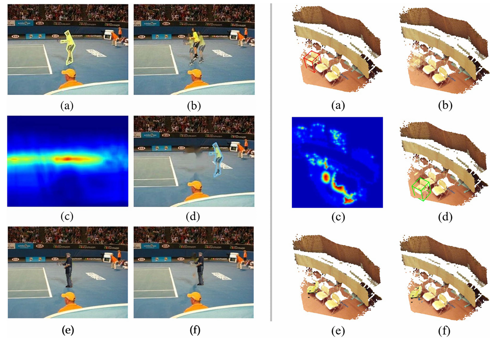

</td>
<td width="80%">

**[InstaBoost++: Visual Coherence Principles for Unified 2D/3D Instance Level Data Augmentation](https://link.springer.com/article/10.1007/s11263-023-01807-9)**  
International Journal of Computer Vision (IJCV), 2023  
**Jianhua Sun**\*, Hao-Shu Fang\*, Yuxuan Li, Runzhong Wang, Minghao Gou and Cewu Lu  

**[Instaboost: Boosting Instance Segmentation via Probability Map Guided Copy-Pasting](https://openaccess.thecvf.com/content_ICCV_2019/papers/Fang_InstaBoost_Boosting_Instance_Segmentation_via_Probability_Map_Guided_Copy-Pasting_ICCV_2019_paper.pdf)**  
IEEE/CVF International Conference on Computer Vision (ICCV), 2019  
Hao-Shu Fang\*, **Jianhua Sun**\*, Runzhong Wang\*, Minghao Gou, Yonglu Li, Cewu Lu  

</td>
</tr>
</table>

<table>
<tr>
<td width="20%">

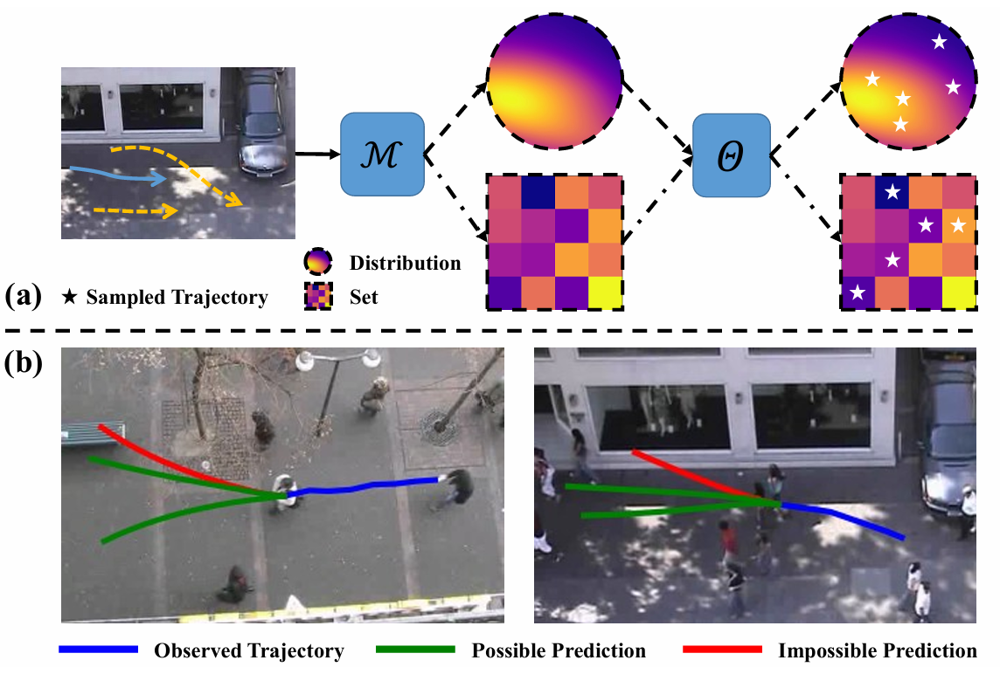

</td>
<td width="80%">

**[Stimulus Verification is a Universal and Effective Sampler in Multi-Modal Human Trajectory Prediction](https://openaccess.thecvf.com/content/CVPR2023/papers/Sun_Stimulus_Verification_Is_a_Universal_and_Effective_Sampler_in_Multi-Modal_CVPR_2023_paper.pdf)**  
IEEE/CVF Conference on Computer Vision and Pattern Recognition (CVPR), 2023  
**Jianhua Sun**\*, Yuxuan Li\*, Liang Chai, Cewu Lu  

</td>
</tr>
</table>

<table>
<tr>
<td width="20%">

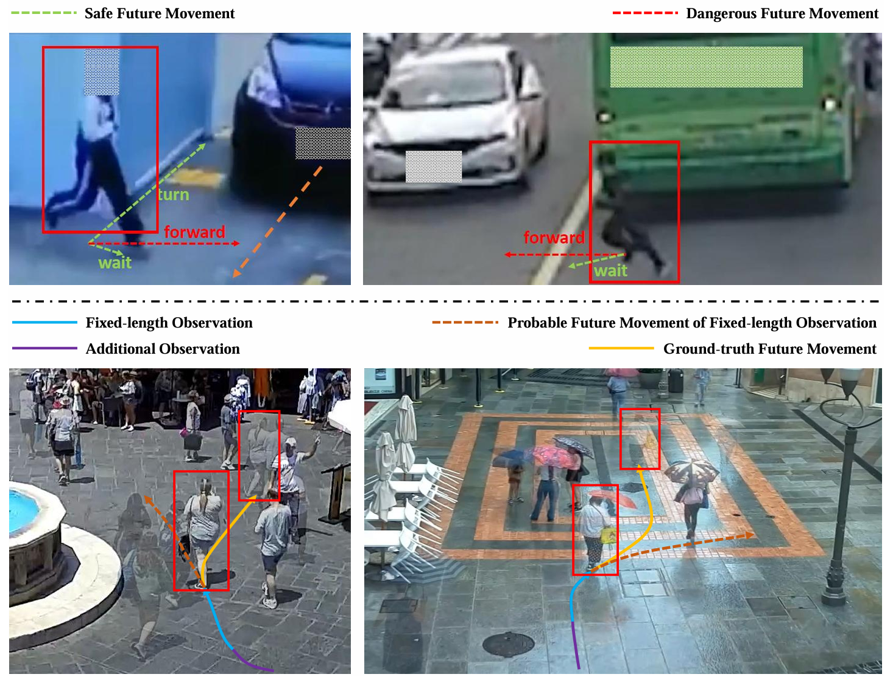

</td>
<td width="80%">

**[Human Trajectory Prediction with Momentary Observation](https://openaccess.thecvf.com/content/CVPR2022/papers/Sun_Human_Trajectory_Prediction_With_Momentary_Observation_CVPR_2022_paper.pdf)**  
IEEE/CVF Conference on Computer Vision and Pattern Recognition (CVPR), 2022  
**Jianhua Sun**, Yuxuan Li, Liang Chai, Hao-Shu Fang, Yong-Lu Li, Cewu Lu  

</td>
</tr>
</table>

<table>
<tr>
<td width="20%">

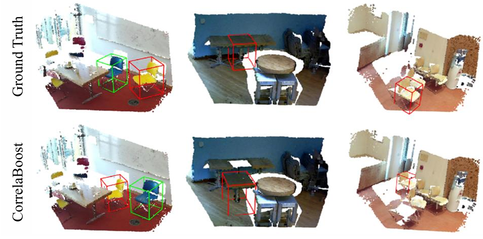

</td>
<td width="80%">

**[Correlation Field for Boosting 3D Object Detection in Structured Scenes](https://ojs.aaai.org/index.php/AAAI/article/download/20128/19887)**  
AAAI Conference on Artificial Intelligence (AAAI), 2022  
**Jianhua Sun**, Hao-Shu Fang, Xianghui Zhu, Jiefeng Li, Cewu Lu  

</td>
</tr>
</table>

<table>
<tr>
<td width="20%">

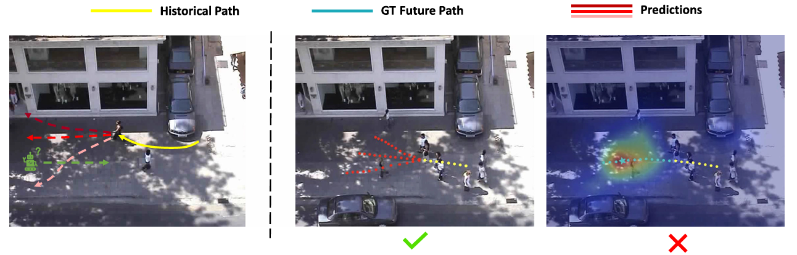

</td>
<td width="80%">

**[Unified and Fast Human Trajectory Prediction Via Conditionally Parameterized Normalizing Flow](https://drive.google.com/file/d/1vKIg-m-Ikan0ZNyjFMTNfH7uQP8iuUKZ/view)**  
IEEE Robotics and Automation Letters (RA-L)  
**Jianhua Sun**, Zehao Wang, Jiefeng Li, Cewu Lu  

</td>
</tr>
</table>

<table>
<tr>
<td width="20%">

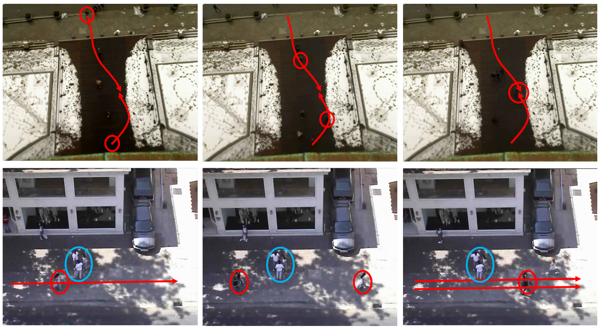

</td>
<td width="80%">

**[Recursive Social Behavior Graph for Trajectory Prediction](https://openaccess.thecvf.com/content_CVPR_2020/papers/Sun_Recursive_Social_Behavior_Graph_for_Trajectory_Prediction_CVPR_2020_paper.pdf)**  
IEEE/CVF Conference on Computer Vision and Pattern Recognition (CVPR), 2020  
**Jianhua Sun**, Qinhong Jiang, Cewu Lu  

</td>
</tr>
</table>

<table>
<tr>
<td width="20%">

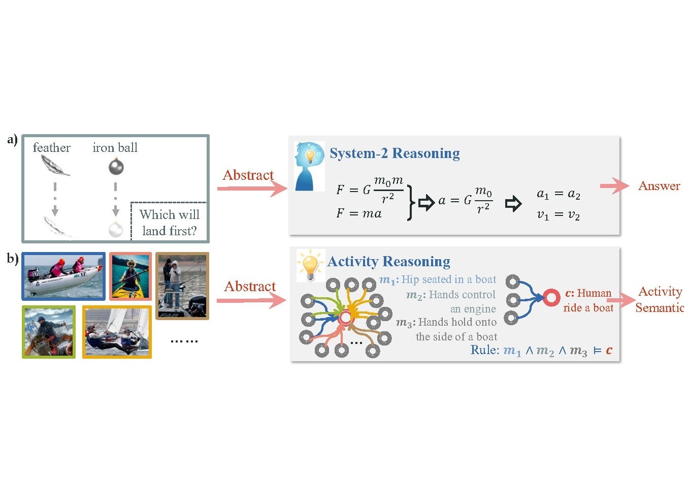

</td>
<td width="80%">

**[Symbol-LLM: Leverage Language Models for Symbolic System in Visual Human Activity Reasoning](https://proceedings.neurips.cc/paper_files/paper/2023/file/5edb57c05c81d04beb716ef1d542fe9e-Paper-Conference.pdf)**  
Conference on Neural Information Processing Systems (NeurIPS), 2023  
Xiaoqian Wu, Yong-Lu Li, **Jianhua Sun**, Cewu Lu  

</td>
</tr>
</table>

